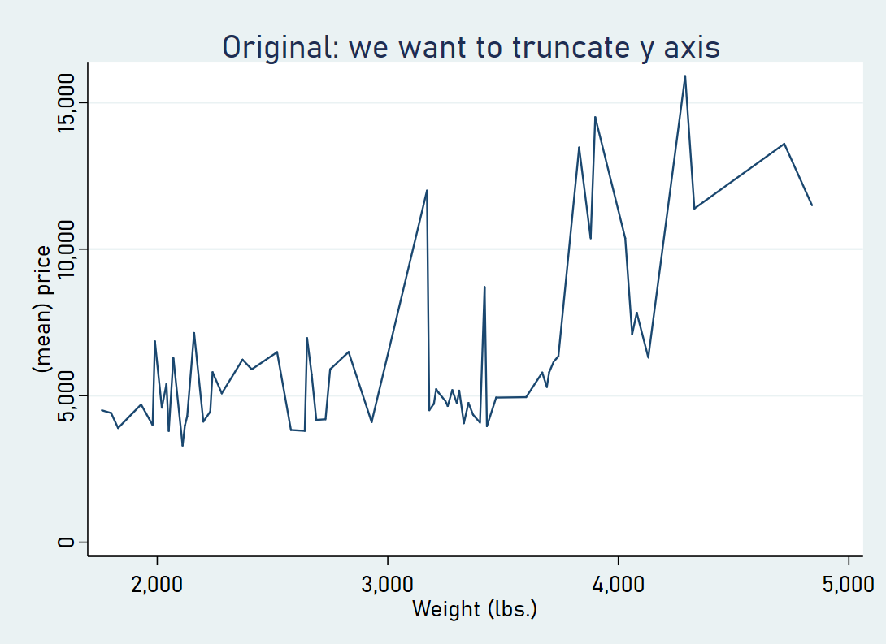

# stata_truncated_chart
 
* Goal: create charts with truncated axis in Stata
* Challenge: Stata always shows all data
* Solution: interpolate data points and show as scatter plot

20200413: Uploaded proof of concept

**The raw chart**

**My solution: truncating the y axis to y<10000**

* Interpolate data points
* See Stata do file for proof of concept.
* Challenge: line gets a bit rugged...

