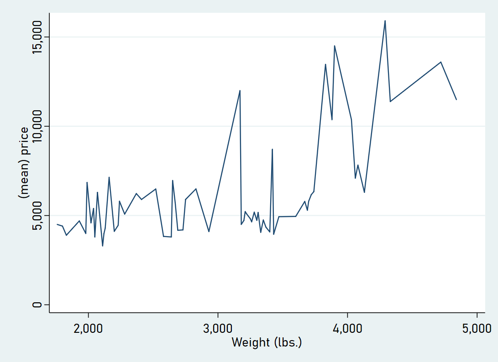
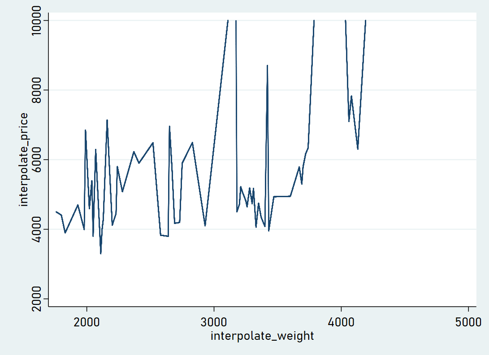

# stata_truncated_chart
 
* Goal: create charts with truncated axis in Stata
* Challenge: Stata always shows all data
* Solution: interpolate data points and show as scatter plot

20200413: Uploaded proof of concept

**The raw chart**

**Often suggested solution 1: use** *yscale*

 *  Challenge: only works for extending the scale, can never be smaller than the data range. 

**Often suggested solution 2: use** *ylab*

 *  Challenge: only affects labels, not axis range.
 

**Often suggested solution 3: use** *if*

 *  Challenge: changes the relationship to show
 

**My solutioon**

* Interpolate data points
* See Stata do file for proof of concept.
* Challenge: line gets a bit rugged...

